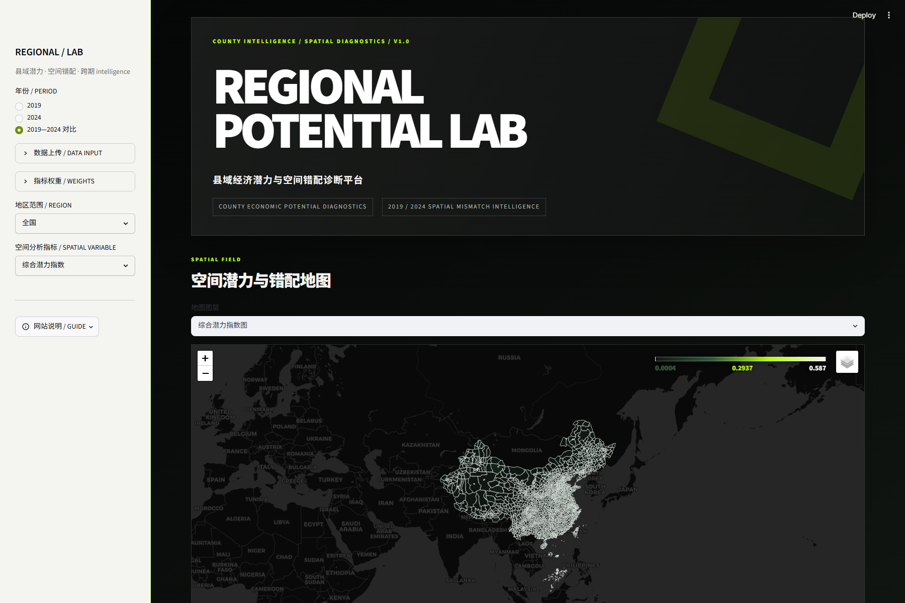
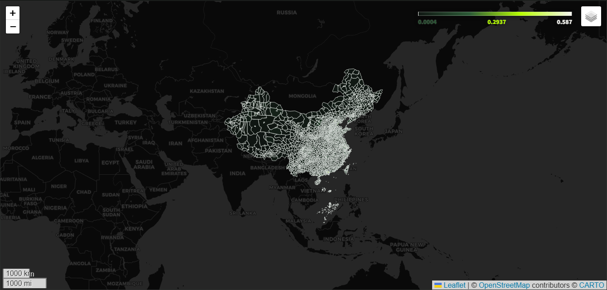
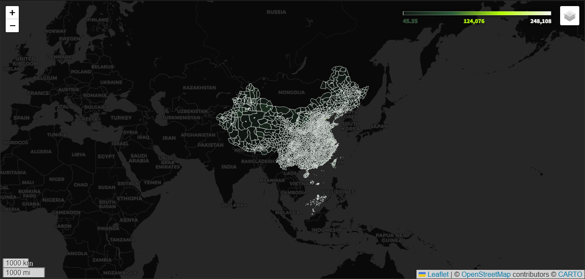
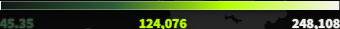

# Regional Potential Lab

县域经济潜力与空间错配诊断平台 V1.0。原型基于 Streamlit、GeoPandas、Folium 与 Plotly，实现 2019/2024 联合尺度评分、空间错配诊断、跨期变化、地图浏览和结果导出。

界面采用原创黑白高对比运动科技风，不包含任何第三方品牌标志、商标、口号或广告素材。

## 立即运行

建议使用 Python 3.10—3.12：

```powershell
cd regional_potential_lab
python -m venv .venv
.\.venv\Scripts\Activate.ps1
python -m pip install -r requirements.txt
streamlit run app.py
```

## 界面预览

首页、侧栏控制与综合潜力地图：



综合潜力指数地图：



夜间灯光空间分布图：



透明渐变图例细节：



## 在线部署

本仓库已包含 Render / Railway 部署配置：

- `render.yaml`：主部署方案，Render Singapore Web Service。
- `railway.json`：Railway Singapore 备用方案。
- `.streamlit/config.toml`：线上 Streamlit 基础配置。
- `DEPLOYMENT.md`：GitHub 私仓、Render、Railway 与 Cloudflare 自定义域名部署步骤。

当前建议链路为：

```text
GitHub 私有仓库 -> Render Singapore -> Cloudflare -> regional-potential-lab.com
```

当前私仓已在 `data/` 内置 app-ready 真实县域数据，Render / Railway 部署后会默认读取 2891 个县域边界与 2019、2024 两期指标表。只有当 `data/` 中没有任何 CSV / GeoJSON 且未配置可用的处理后数据目录时，应用才会自动回退到 `sample/` 中的 12 个虚构县区。

`requirements.txt` 已包含线上部署所需的空间统计依赖，因此 Render / Railway 默认构建后应可直接运行 Moran's I 与 LISA。本地如果只想安装轻量基础依赖，可自行临时移除 `libpysal` 和 `esda`；也可以单独安装空间依赖：

```powershell
python -m pip install -r requirements-spatial.txt
```

如果 PySAL / esda 未安装、有效样本少于 4、指标为常数或空间权重失败，页面仅显示“空间分析暂不可用”，地图、指标、对比和导出继续运行。

## 接入真实数据

将文件放入 `data/`，详细字段表见 [`data/README_data_schema.md`](data/README_data_schema.md)。也可以在页面侧栏逐项上传；上传文件优先于 `data/` 同名文件。

必需路径：

```text
data/county_boundary.geojson
data/nightlight_2019.csv
data/nightlight_2024.csv
data/population_2019.csv
data/population_2024.csv
data/road_2019.csv
data/road_2024.csv
data/economy_2019.csv
data/economy_2024.csv
```

允许的替代：

- `road_2019.csv` 暂缺：采用 `road_2024.csv` 作为静态交通支撑，页面和 `road_year_display` 明示真实年份。
- `economy_2024.csv` 暂缺：读取 `economy_2023.csv`，分析期保持 2024，`year_display` 明确为 2023。

注意：只要 `data/` 中出现 CSV 或 GeoJSON，应用就进入真实数据模式，不会把缺失部分自动混入虚构样例数据。

### 当前真实数据流水线

当前项目也支持 `config/data_sources.json` 指向外部只读原始目录。执行：

```powershell
python scripts/process_real_data.py --output-root outputs/real_data_v2
```

脚本不会修改原始文件。当前 V2 的主结果、诊断报告和空间分析结果统一输出到 `outputs/real_data_v2/`，网页应用数据位于 `outputs/real_data_v2/app_data/`。为保证 Render 等线上环境无需访问本机 `E:/Housework/...` 路径即可显示真实县域边界，当前已将 `outputs/real_data_v2/app_data/` 中的 9 个 app-ready 文件同步复制到 `data/`。旧版 `outputs/processed/` 仅保留用于结果对照，不参与 V2 计算。

经济源表同时支持两种结构：旧宽表（`gdp_2019`、`gdp_2024`）和新长表（`county_code`、`year`、`gdp`、`gdp_per_capita`、`gdp_density`）。长表必须保证 `county_code + year` 唯一；无法解析的数值继续保留为 NA。

当前路网是同一静态截面复制到2019和2024，仅用于表征交通支撑条件，不能解释为两期路网变化。源路网 `city` 字段为4位地市代码，标准化阶段会转换为权威中文名称。

地市名称现已按民政部《2023年中华人民共和国县以上行政区划代码》生成本地快照 `reference/mca_city_codes_2023.csv`。标准化输出中的 `city` 为中文名称，`city_code` 保留原始四位代码，`city_mapping_type` 与 `city_mapping_status` 用于追溯。需要刷新官方快照时运行：

```powershell
python scripts/build_admin_reference.py
```

网页主页面优先展示地图；平台介绍、使用说明、数据口径、完整性和快速诊断收纳在左侧栏底部的“网站说明 / GUIDE”按钮中。

## 指标口径

所有县域的 2019 与 2024 原始指标先纵向合并，再按字段执行一次 min-max 标准化。评分早于年份和地区筛选，因此两期得分同尺度、不同地区筛选结果仍可比较。全空列和常数列标准化为 NA，不参与后续评分；原始缺失值始终保持为 NA。

默认公式：

```text
economic_score = 0.25*gdp + 0.20*gdp_per_capita + 0.20*gdp_density
               + 0.20*ntl_sum + 0.15*ntl_mean
population_score = 0.50*pop_total + 0.50*pop_density
transport_score = 0.60*road_density + 0.40*highway_density
potential_score = 0.45*economic_score + 0.25*population_score + 0.30*transport_score
support_score = 0.45*population_score + 0.55*transport_score
```

上式中的原始字段均指联合尺度标准化值。侧栏允许修改四组权重；每组自动归一化，全零时回退默认权重。

### 缺失数据与动态权重

系统不对 GDP 或其他核心指标进行均值、中位数、邻近县、夜间灯光或模型插补，也不填 0、不删除县域。某县某项指标为 NA 时，该项权重退出该县评分，其余有效权重按原权重比例重新归一化。所有输入都无效时，对应指数保持 NA。

结果保留 `missing_gdp`、两类缺失计数、四类有效权重和及 `score_quality_flag`。质量规则为：完整数据 `complete`；少量缺失但可计算 `partial`；原始核心指标缺失不少于 3 项，或任一实际参与的分项/综合有效权重低于 0.50 时为 `weak`；综合指数不可计算时为 `unavailable`。

## 已实现功能

- 本地默认数据、侧栏上传与内置样例三种入口
- 按字符串读取 `county_code`，保留前导 `0`
- 字段级校验、年份替代与页面诊断提示
- 2019、2024 单期及 2019—2024 对比
- 全国、省份、地市、县区级联筛选
- 联合尺度经济、人口、交通、综合潜力评分
- NA 感知的逐县动态权重归一化与评分质量标记
- 数据完整性统计、GDP 缺失比例和低可信县域提示
- 四类空间错配诊断
- 六个变化量和四个安全增长率
- 综合潜力、空间错配、GDP、灯光、人口、交通、LISA、跨期变化地图
- 可选 Moran's I 与 LISA
- Plotly 排名与错配结构图
- 当前筛选结果 CSV 与 GeoJSON 下载

## 项目结构

```text
regional_potential_lab/
├── app.py
├── requirements.txt
├── requirements-spatial.txt
├── README.md
├── data/
│   └── README_data_schema.md
├── sample/
│   ├── generate_sample_data.py
│   └── 示例 GeoJSON / CSV
├── src/
│   ├── data_loader.py
│   ├── indicator_engine.py
│   ├── spatial_analysis.py
│   ├── map_view.py
│   ├── export_utils.py
│   └── ui_style.py
├── tests/
└── outputs/
```

## 验证

安装基础依赖后运行：

```powershell
python -m unittest discover -s tests -v
python -m compileall app.py src tests
streamlit run app.py
```
