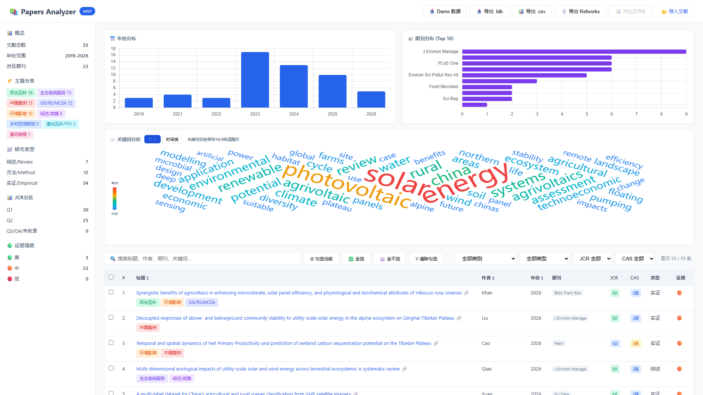
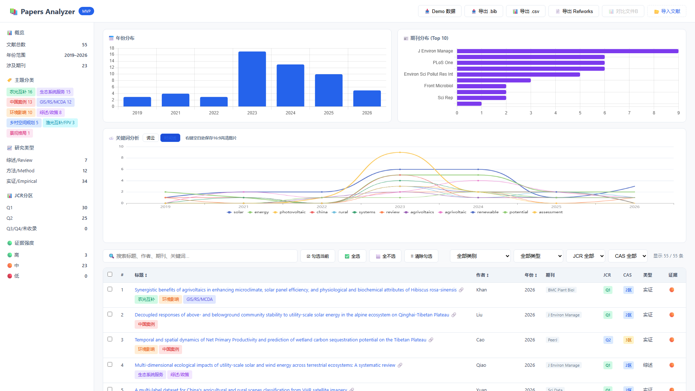
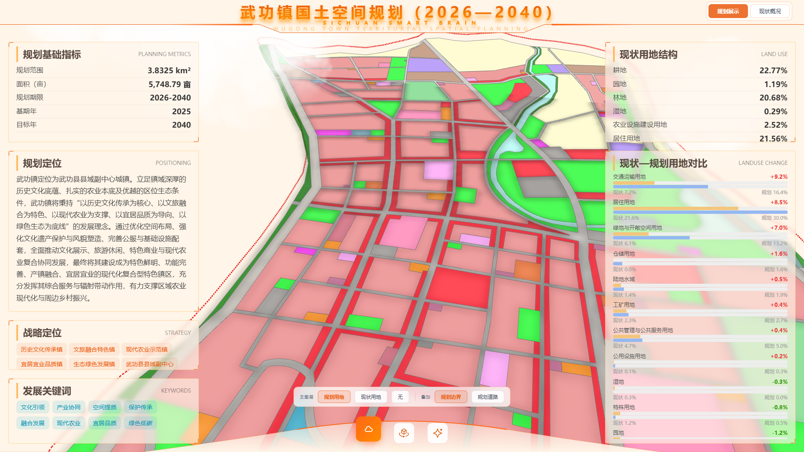
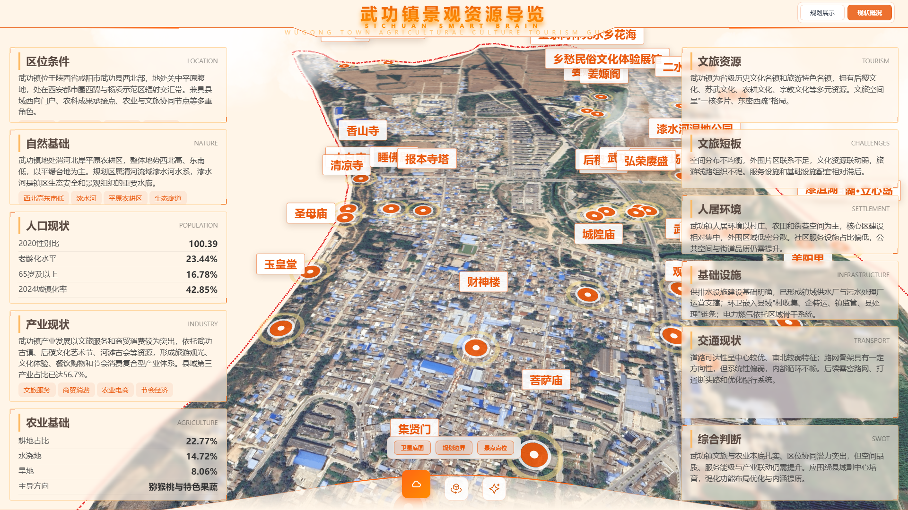

# 项目运行画面与介绍

这组项目围绕三个实际任务展开：整理研究文献、比较县域发展差异、展示城镇规划方案。下列画面来自真实运行界面，可用于快速了解项目，也可作为汇报时的演示参考。

## 01 · Papers Analyzer：让文献集合可以被浏览与比较

**出发点。** 文献检索之后，仍需要看清研究主题、发表年份、期刊分布，并筛选出值得进一步阅读的条目。这个工具把文献文件转成可筛选的表格和统计图，减少反复整理文件的步骤。

**输入与输出。** 输入 BibTeX、RIS、CSV 或 CNKI Refworks；输出筛选后的文献文件和可视化统计。解析在浏览器本地完成。

### 文献概览与关键词词云

画面使用工具自带的 55 篇“光伏+”Demo 文献。左侧是分类与分区统计，上方显示年份和期刊分布，中部词云呈现高频词，下方表格用于查找、勾选和导出文献。截图中的统计仅描述这组 Demo，不代表整个研究领域。

### 关键词时间线

切换“时间线”后，可以观察所选文献集内关键词的年份分布，再回到条目核查具体研究。适合开题准备、文献初筛和组会中的资料介绍。

**建议演示：** 点击 Demo 数据 → 展示词云 → 切换时间线 → 搜索一个关键词 → 勾选并导出文献。若首次词云未铺满，切换一次标签或调整窗口尺寸，等待布局完成。

[在线体验](https://bib-analysis-tool.vercel.app) · [源码与复刻说明](../../projects/research/papers-analyzer/README.md)

## 02 · 武功镇国土空间规划：把方案图纸变成可交互的展示

**出发点。** 规划汇报通常需要在图纸、指标表和现状资料之间切换。这个项目把用地、道路、规划定位与景观资源放进同一三维界面，让讲解能围绕具体空间展开。

**输入与输出。** 输入 GIS 图层、指标、景点信息和底图；输出可切换图层、查看用地信息的规划大屏。页面展示的规划期限为 2026—2040 年，不代表其法定审批状态。

### 规划展示

中间是分类着色的用地和道路，左侧说明规划范围与定位，右侧展示现状用地结构及变化比较。底部可切换规划用地、现状用地及叠加图层，适合边讲方案边定位地块。

### 现状概况与景观资源导览

切换到“现状概况”后，同一空间位置呈现卫星底图与景点点位，两侧显示区位、人口、产业、文旅和基础设施等信息。适合把现状判断与规划策略对应起来讲解。截图保留线上现有布局，局部景点标签仍有重叠。

**建议演示：** 规划展示 → 切换现状用地 → 返回规划用地 → 现状概况 → 查看景点。卫星底图较大，汇报前先加载一次并等图片显示完整。

[在线体验](https://wugong-sc-datav.vercel.app/sc-datav/#/wugong) · [源码与复刻说明](../../projects/spatial/wugong-territorial-planning/README.md)

## 03 · Regional Potential Lab：从多项指标理解县域差异

**出发点。** 县域比较需要把经济、人口与交通放在同一尺度上，并明确缺失数据会怎样影响判断。平台将指标评分、空间分布、跨期比较与结果导出放在同一工作流中。

**输入与输出。** 输入县域边界及 2019/2024 年相关指标；输出综合潜力、空间错配、跨期变化等地图与表格。评分是模型下的分析结果，不是对发展潜力的确定性预测。

### 平台界面与分析入口

侧栏提供年份、地区、权重和分析变量选择；主界面承载地图与分析结果。这张图是仓库已有运行截图，于 2026-06-25 提交保存，展示的是当时版本。

### 综合潜力地图

地图把县域评分放回空间位置，配合年份与地区筛选支持区域比较。可进一步切换到夜间灯光、人口、交通或错配指标，导出结果用于分析和汇报。

**建议演示：** 本地启动 → 选择内蒙古自治区等适当范围 → 切换分析变量 → 比较 2019/2024 → 导出结果。

[运行与使用说明](../../README.md#regional-potential-lab) · [部署说明](../../DEPLOYMENT.md)

## 截图来源与展示范围

| 图片 | 来源 | 状态 |
| --- | --- | --- |
| Papers Analyzer 两张 | 2026-09-12 线上页面，1920×1080，加载内置 Demo 后截取 | 本次新截图 |
| 武功镇地图两张 | 2026-09-12 线上页面，1920×1080，切换模式并等待纹理加载 | 本次新截图 |
| Regional Potential Lab 两张 | 仓库 `docs/screenshots/`，2026-06-25 提交的运行截图 | 历史运行画面 |

本次访问县域平台自定义域名连接失败，Render 地址未加载出可用界面，因此未把历史截图冒充本次在线状态。图片均为浏览器运行画面，没有重绘界面或改写展示数据。介绍仅对应已有功能，不代表所有模块完成验收。
